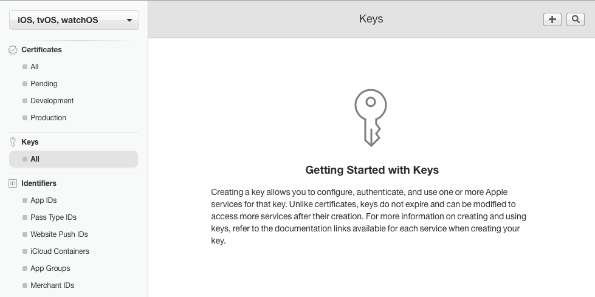
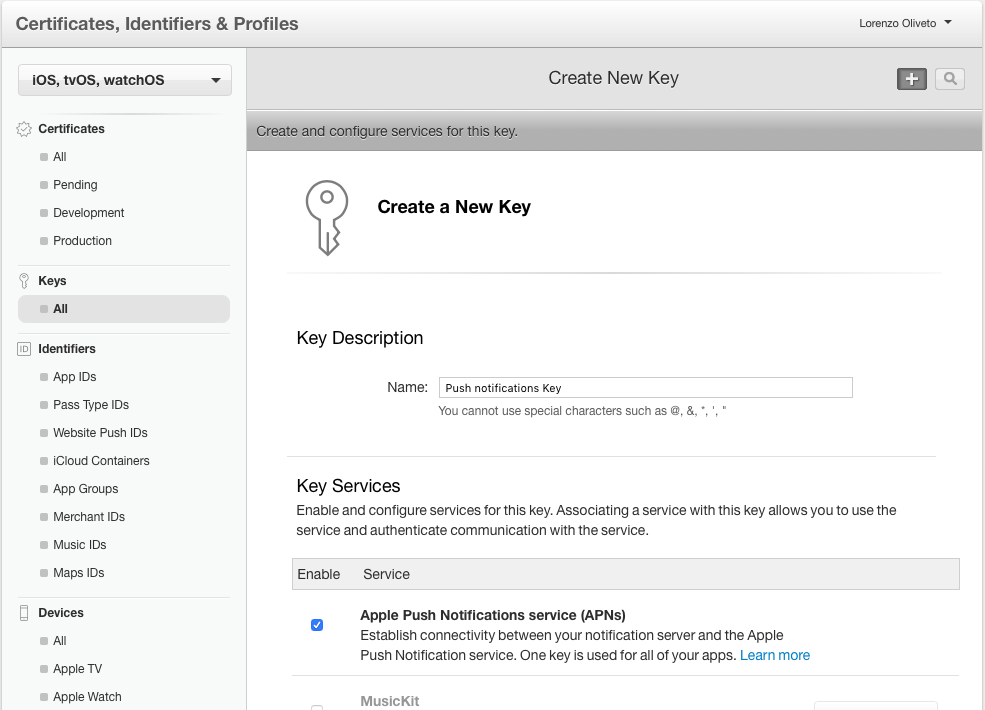
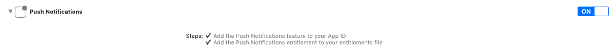

# MPush iOS SDK


[](LICENSE)

MPush is a client libary, written in Swift, that can be used to interact with the [MPush](https://mpush.app) API. The minimum deplaoyment target for the library is iOS 11.0. 

MPush uses a classic Pub/Sub pattern, you will register your devce to topics, then from the MPush apis you will be able to send notifications to those topics and all device registered will receive a notification.

A topic can represent whatever you want in your system (e.g. the entire app, a user a subset of user with a common charachteristic) so you will be able to choose the granularity of the notifications.

# Minimum Requirements

- [Swift 4.0+](https://github.com/pusher/push-notifications-swift/commit/d6dfa2186195135d8d7d1e3d3efdd7f8661ea404)
- [Xcode](https://itunes.apple.com/us/app/xcode/id497799835) - The easiest way to get Xcode is from the [App Store](https://itunes.apple.com/us/app/xcode/id497799835?mt=12), but you can also download it from [developer.apple.com](https://developer.apple.com/) if you have an AppleID registered with an Apple Developer account.

# Installation

# Installation with CocoaPods
CocoaPods is a dependency manager for iOS, which automates and simplifies the process of using 3rd-party libraries in your projects. You can install CocoaPods with the following command:

```ruby
$ gem install cocoapods
```
To integrate the MPush into your Xcode project using CocoaPods, specify it in your Podfile:

```ruby
platform :ios, '10.0'

target 'TargetName' do
	use_frameworks!

    pod 'MPushSwift'
end
```

Then, run the following command:

```
$ pod install
```

CocoaPods is the preferred methot to install the library.

# Manual installation

To install the library manually drag and drop the folder `MPush` to your project structure in XCode. 

Note that `MPush` has `Alamofire (4.0)` as dependency, so you have to install also this library.

# Usage

The first thig you have to do is implement Push Notifications using the [UserNotifications](https://developer.apple.com/documentation/usernotifications) framework.

> You will be guided through all the steps needed to have a functional project wth the push notifications, if you have already done it you can skip to the [Integrate MPush](#integrate-mpush) section of this README.


# Create a key

Go to [developer.apple.com](https://www.developer.apple.com) with an admin account and under Keys -> All click the plus button in the top right corner.
 Specify a name for your key and enable Apple Push Notifications service (APNs).




Then download the .p8 key file created and upload it in our [dashboard](https://mpush.app).

> Note that the key created is valid for all the apps of your profile and can't be re-downloaded, keep it in a safe place because you will likely have to resue it.

# Add notifications to your app

Now go to your app settings under Identifier -> AppId and enable the notifications services following the steps. After that you need to update the Provisioning Profile for your app or create a new one because push notifications donesn't work for applications signed with a wildcard Provisioning Profile.

Now it's finally time to move to XCode. Open your project and enable push notifications in the capabilities tab.



In `AppDelegate.swift` add

```swift
import UserNotifications

func application(_ application: UIApplication, didFinishLaunchingWithOptions launchOptions: [UIApplication.LaunchOptionsKey: Any]?) -> Bool {
    ...
    
    let userNotificationCenter = UNUserNotificationCenter.current()
    userNotificationCenter.delegate = self

    self.registerForPushNotifications()
	...
}

// MARK: - Notifications
    
func registerForPushNotifications() {
    UNUserNotificationCenter.current().requestAuthorization(options: [.alert, .sound, .badge]) { (granted, _) in
        guard granted else { return }
        self.getNotificationSettings()
    }
}
    
func getNotificationSettings() {
    UNUserNotificationCenter.current().getNotificationSettings { (settings) in
        guard settings.authorizationStatus == .authorized else { return }
        DispatchQueue.main.async {
            UIApplication.shared.registerForRemoteNotifications()
        }
    }
}

extension AppDelegate: UNUserNotificationCenterDelegate {
    func userNotificationCenter(_ center: UNUserNotificationCenter,
                                willPresent notification: UNNotification,
                                withCompletionHandler
                                completionHandler: @escaping (UNNotificationPresentationOptions) -> Void) {
        completionHandler(UNNotificationPresentationOptions.alert)
    }
    
    func userNotificationCenter(_ center: UNUserNotificationCenter,
                                didReceive response: UNNotificationResponse,
                                withCompletionHandler
                                completionHandler: @escaping () -> Void) {
        completionHandler()
    }
}

```

# Integrate MPush

To integrate MPush to your implementation you need to add this in your AppDelegate

```swift
import MPushSwift

func application(_ application: UIApplication, didFinishLaunchingWithOptions launchOptions: [UIApplication.LaunchOptionsKey: Any]?) -> Bool {
    ...
    MPush.token = "YOUR_PUSH_TOKEN"
    ...
}

...

func application(_ application: UIApplication, didRegisterForRemoteNotificationsWithDeviceToken deviceToken: Data) {
    MPush.registerDevice(deviceToken: deviceToken, success: {
        MPush.register(toTopic: "YOUR_TOPIC")
        // OR if you have more than one topic
        // MPush.register(toTopics: ["TOPIC1", "TOPIC2"])
    })
}

```
You're set 🎉, the device will receive notifications for the topic is registered to. 

# Rich Notifications

To implement rich notifications you will have to create a new Notificaiton Service Target that will be responsible for downloading the media of the notification and attach it to the notification object.

In Xcode go to File -> New -> Target and choose Notification Service Extension

> Keep in mind that notifications don't have much time to download the media attached, if the dowload doen't finish in a short period of time the notification will be delivered without the media.

To handle MPush attachments add this your `NotificationService` should look like this:

```swift
override func didReceive(_ request: UNNotificationRequest, withContentHandler contentHandler: @escaping (UNNotificationContent) -> Void) {
    self.contentHandler = contentHandler
    bestAttemptContent = (request.content.mutableCopy() as? UNMutableNotificationContent)
    
    if let bestAttemptContent = bestAttemptContent {
        if let mediaUrl = request.content.userInfo["media_url"] as? String, let fileUrl = URL(string: mediaUrl) {
            downloadMedia(fileUrl: fileUrl, request: request, bestAttemptContent: bestAttemptContent) {
                contentHandler(bestAttemptContent)
            }
        } else {
            contentHandler(bestAttemptContent)
        }
    }
}
    
func downloadMedia(fileUrl: URL, request: UNNotificationRequest, bestAttemptContent: UNMutableNotificationContent, completion: () -> Void) {
    let task = URLSession.shared.downloadTask(with: fileUrl) { (location, _, _) in
        if let location = location {
            let tmpDirectory = NSTemporaryDirectory()
            let tmpFile = "file://".appending(tmpDirectory).appending(fileUrl.lastPathComponent)
            let tmpUrl = URL(string: tmpFile)!
            do {
                try FileManager.default.moveItem(at: location, to: tmpUrl)
                
                var options: [String: String]? = nil
                if let type = request.content.userInfo["media_type"] as? String {
                    options = [String: String]()
                    options?[UNNotificationAttachmentOptionsTypeHintKey] = type
                }
                if let attachment = try? UNNotificationAttachment(identifier: "media." + fileUrl.pathExtension, url: tmpUrl, options: options) {
                    bestAttemptContent.attachments = [attachment]
                }
            } catch {}
        }
    }
    task.resume()
}

override func serviceExtensionTimeWillExpire() {
    // Called just before the extension will be terminated by the system.
    // Use this as an opportunity to deliver your "best attempt" at modified content, otherwise the original push payload will be used.
    if let contentHandler = contentHandler, let bestAttemptContent =  bestAttemptContent {
        contentHandler(bestAttemptContent)
    }
}
```

With this code we download the attachemnt, if exists, and move it to a temporary directory. Then we add it to our notification with 

```swift
if let attachment = try? UNNotificationAttachment(identifier: "media." + fileUrl.pathExtension, url: tmpUrl, options: options) {
    bestAttemptContent.attachments = [attachment]
}
```

# License

MPush is released under the MIT license. See [LICENSE](LICENSE) for details.
